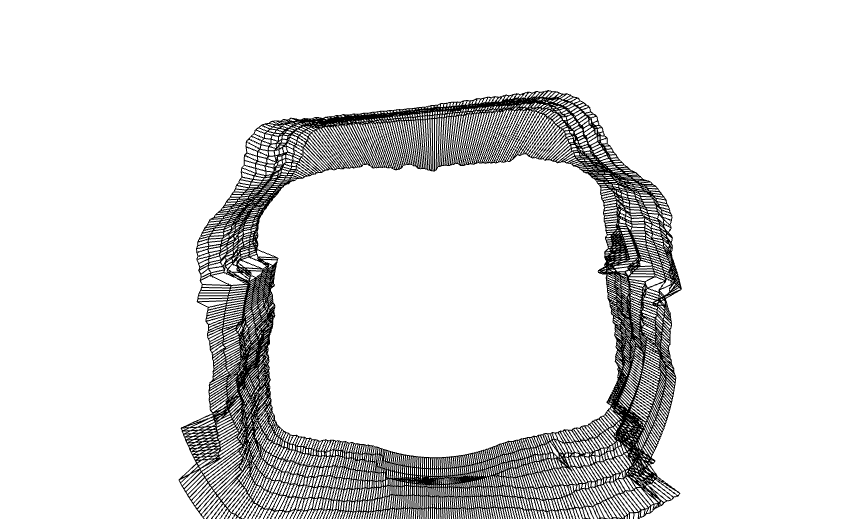
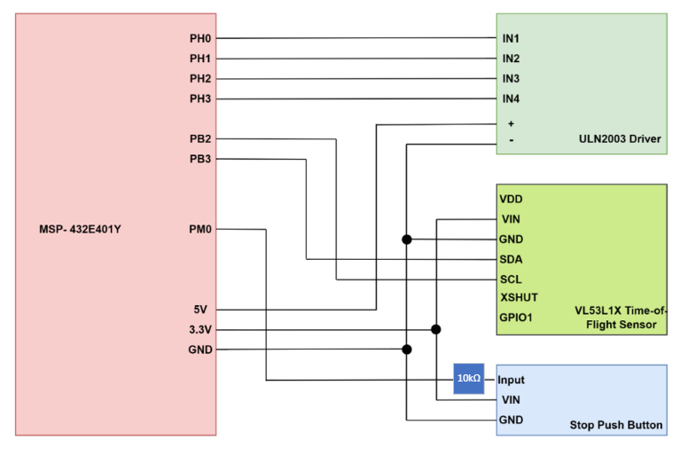

# Spatial-Mapping-System
**The SMSUTOFv0.1 is an embedded spatial measurement device I've created which uses a VL53L1X time-of-flight sensor to acquire information about the area around you and generates a 3D mapping of a scanned area.**

Check out the datasheet for this project: [SMSUTOFv01 Datasheet](SMSUTOFv01-datasheet.pdf)

## Demo

  

    
Area scanned:

    
  

  

    
Output plot:

    
  

## Setting up:

1. Build the circuit based on the following schematic:

Ensure the ToF is mounted to the stepper motor. The Keil project should be flashed on the micro controller by default, so pressing the reset button is sufficient to load the program. If this is not the case: Open the Keil Project src found [here](main-keil) then translate, build and load the program.

## Software Installation:

1. Download Python 3.9, which can be found at https://www.python.org/downloads/ under specific release downloads.
2. Install NumPy, open3d, and Pyserial:

`pip install numpy`

`pip install open3d`

`pip install pyserial`

Refer to their documentation for any issues:
* NumPy documentation: https://numpy.org/doc/1.21/
* Open3D documentation: http://www.open3d.org/docs/release/
* Pyserial documentation: https://pyserial.readthedocs.io/en/latest/pyserial.html

## How to use the device after setting up: 

1. Open `measurement_data.py` and modify the PORT variable to that of your device, found from UART port listed in device manager. 
2. Run `measurement_data.py` by opening terminal, navigating to the directory of the file, and entering `python measurement_data.py`
3. Enter how many displacement steps the scan will use when prompted by the program. 
4. Press the peripheral push button to enable measurements to set up the ToF. Pressing this again will toggle this back off.
5. Press the the onboard PJ1 button each time a measurement rotation has to be made. Pressing this again will end the rotation process.
6. For each number of physical steps taken, wait for the motor to complete one full rotation and return back to the home position. Once this is complete, move forward by the amount of x-displacement increment set (350 mm in the program but modifiable by user in the `STEP_INCREMENT` variable) 
7. Press the button again for the next measurement.
8. The program will then print to you the measurements at each point taken as the program runs from the scan and also output this to a file in the same directory called `pointdata.xyz`. D3 LED will flash on the micro controller for verification purposes. 
9. Run the `spatial_visualization.py` file by typing `python spatial_visualization.py` in terminal.
10. When prompted, enter the number of scans taken. The program will use this and then output the numerical value to the user in the console and output the visualization points on the screen in a GUI. Closing this screen will show a new screen with final spatial map in a GUI. 

The scan is of a yz-plane with x being the displacement taken for each scan. `y` and `z` are seen as the vertical plane that the motor rotates and scans for, and `x` is the displacement after physically moving the motor by the step increment defined.

The spatial map should now be visible to you in an interactive GUI window.

